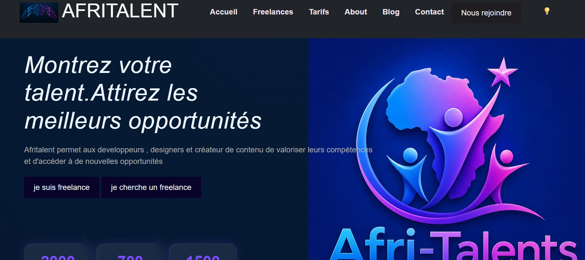

# KANE_DIEYNABA_AFRITALENT
projet de classe

#Afritalent est une plateforme web conçu pour connecter les freelances et les entreprises.
ce projet à été realisé dans le cadre du deuxieme semestre à l'ISI(INSTITUT SUPERIEUR D'INFORMATIQUE).

##🌠Lien du site en ligne
Vous pouvez visiter le site en ligne ici :
(https://dieynabakane058-ship-it.github.io/KANE_DIEYNABA_AFRITALENT/)

##📸 Aperçu du projet

##⭐L'equipe du projet
. *Madame KANE* : Créatrice de contenu
. *Monsieur KIYOTAKA* : Team Lead
. *Monsieur AW* & *Monsieur YAGAMI* : Développeurs
. *Madame MIKASA* : Designer
. *Monsieur ARMIN* & *Madame HINATA* : Redacteur Tech

##🛠️Technologies utilisées
. HTML5
. CSS
. JavaScript
.Boostrap